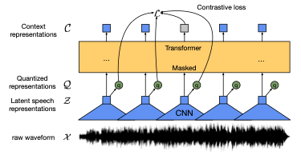
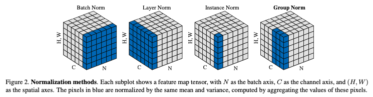
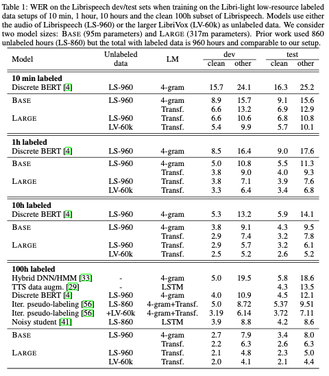
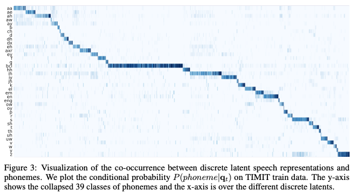

<link rel="stylesheet" href="https://cdn.jsdelivr.net/npm/katex@0.10.2/dist/katex.min.css" integrity="sha384-yFRtMMDnQtDRO8rLpMIKrtPCD5jdktao2TV19YiZYWMDkUR5GQZR/NOVTdquEx1j" crossorigin="anonymous">

# [wav2vec 2.0: A Framework for Self-Supervised Learning of Speech Representations - Baevski et al. 2020](https://arxiv.org/abs/2006.11477)

## Summary

 
[Baevski et al. 2020]

Devise a self-supervised contrastive setup (continuous inputs, discrete targets)
that achieves SOTA on low-resource ASR with fine-tuning.

## 2 Model 

a stack of blocks:
- feature encoder mapping waveform to representations
- Transformer taking reps to new contextual representations
- quantization for encoder features to be targets for contextual reps

### Feature encoder
- stack of temporal convolution followed by GELU activation
  - after first temporal convolution do group norm before GELU (split channels
    of convolution into groups, normalize within each group)
- layer norm after last output

 
[Wu and He 2018]

### Transformer

A standard Transformer architecture with a modification to the positional
embeddings

#### Positional embeddings
- convolutional layer with \\(k = \\) 128, 16 groups followed by GELU
- add output to inputs and apply layer norm

### Quantization

Given quantized vectors, use Gumbel softmax to choose them in a differentiable
way. On forward pass use argmax, on backward pass use gradient (straight-through
estimator).

#### Product quantization
Given \\(G\\) codebooks containing \\(V\\) vectors of size \\(d/G\\), choose one
entry from each codebook and concatenate to \\([e_1, ... e_G]\\) and apply a
transformation \\(\mathbb{R}^d \to \mathbb{R}^f\\) to get a quantization \\(q 
\in \mathbb{R}^f\\)

## 3 Training

### Self-supervised
Mask certain inputs to Transformer, then identify which are the correct
reconstructions.

#### 3.1 Masking
Sample \\(p = 0.065\\) timesteps of Transformer inputs w/o replacement, then
mask the next 10 steps allowing overlaps. ~49% are masked this way, covering
around 299ms.

#### 3.2 Objective
\\[L = L_{mask} + \alpha L_{diversity} + \beta L_{encoder}\\]

##### Masking loss
Given Transformer output (contextual representation), \\(c_t\\) at step \\(t\\), identify true
quantized representation \\(q_t\\) in a set of \\(K+1\\) possibilities. Sample distractors
uniformly as quantized reps from other timesteps in same utterance.

The loss is given by
\\[ L_{mask} = -\log \frac{\frac{\exp(sim(c_t, q_t))}{\kappa}}{\sum_{\tilde{q} \sim Q_t} \frac{\exp(sim(c_t, \tilde{q}))}{\kappa}} \\]

where \\[ sim(a,b) = \frac{a^T b}{\lVert a \rVert \lVert b\rVert} \\] is cosine
similarity.

##### Diversity loss
To encourage even use of the whole codebook, maximize the entropy of the softmax
distribution over codebook entries for each codebook:

\\[ L_{diversity} = \frac{1}{GV} \sum_{g=1}^G \bar{p}_{g, v} \log \bar{p}_{g, v} \\]

where \\( \bar{p}_{g,v} = softmax(l_{g,v}) \\), the softmax distribution (instead of
Gumbel-softmax with temperature).

##### Stability loss
To stabilize feature encoder, apply L2 regularization on final output of feature
encoder **before** last layer normalization. The encoder also has a scaled (down)
learning rate by \\(\gamma\\).

### 3.3 Fine-tuning (supervised)

Add a linear layer on top of Transformer to classify the contextual
representations into each token for the final task (characters, phones) at each
timestep, then use CTC loss to train for speech recognition.

## 4 Experimental setup

### 4.1 Datasets

unlabeled data:
- LibriSpeech (960 hrs)
- LibriVox (53.2k hrs)

labeled data (character level):
- LibriSpeech 960 hrs 
- LibriSpeech 100 hrs
- LibriSpeech 10 hrs
- LibriSpeech 1 hr
- LibriSpeech 10 min
- evaluate on standard dev/test

10 hrs/1 hr/10 min come from Libri-light

labeled data (phone level):
- TIMIT
- evaluate on standard dev/test

### 4.2 Pre-training

Batches of data are built by cropping 250k audio samples, 15.6 sec, from each
utterance. Crops are batched to not exceed 1.4m samples per GPU, trained on
64-128 GPUs.

#### Optimizer
Adam, warm-up for first 8% of steps, then decay linearly. Codebook has G=2
groups, and V=320 entries, with sizes (128, 384). Softmax temperature is
annealed multiplicatively from 2 to (0.5, 0.1) by 0.999995. Feature encoder
gradients are scaled by 0.1 for LibriSpeech and 0.03 for LibriVox. The
distractor set is K=100 examples in the masking loss. Choose training checkpoint
with lowest masking loss.

### 4.3 Fine-tuning

#### Optimizer
Adam, warm-up for first 10%, stay constant for 40%, linearly decay the rest.
Batches are of size (3.2m, 1.28m) samples. For first 10k updates, only output
classifier is trained, then Transformer is updated too. Feature encoder is not
trained during fine-tuning. During fine-tuning the feature encoder
representations are masked similarly to SpecAugment (with time and channels
instead of time and frequency).

Best models are chosen according to performance on dev-other.

### 4.4 Language models and decoding
Two kinds:
- 4-gram
- Transformer trained on LibriSpeech LM

Decoding during training:
- 4-gram: beam 500
- Transformer: beam 50

Decoding at test:
- 4-gram: beam 1500
- Transformer: beam 500

## 5 Results

 
[Baevski et al. 2020]

### 5.1 Low-resource labeled data evaluation

Table 1 for most of the results, a 30% improvement over Discrete-BERT (strongest
previous result from the same group). Basically, it's the best.

### 5.2 High-resource labeled data evaluation on LibriSpeech

Basically, they're almost the best. Failings blamed on weaker architecture (
Transformer vs. ContextNet) and using CTC which has independence assumption.

### 5.3 Phoneme recognition on TIMIT
No language model, new SOTA.

By computing discrete latents for training data of TIMIT, and computing
co-occurrence with phoneme labels, they make this plot:

 
[Baevski et al. 2020]

### 5.4 Ablations

Table 4 explains why quantization only happens for targets and not inputs
(suggested that quantized targets give more robust training, while continuous
inputs preserve more info).

### Followup

Can we take this out of the model setting and do it with YouTube data for a
language we don't have LibriSpeech for?
